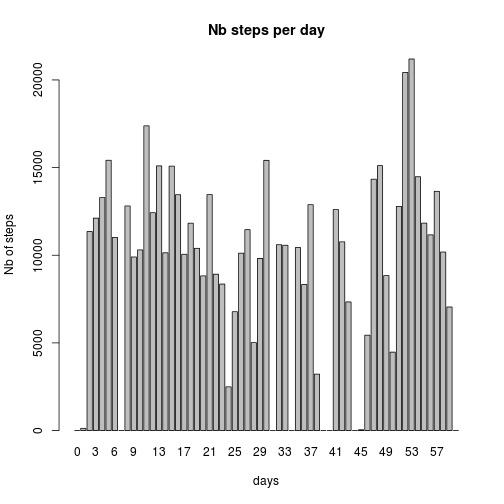
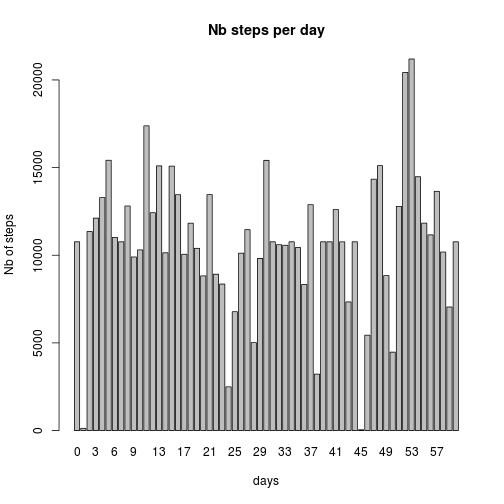
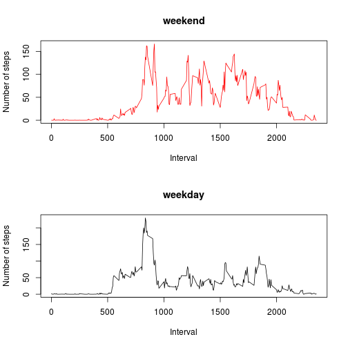

Project 1 Reproducible research Coursera
========================================================

## Load data and add an extra column for the day


```r
data <- read.csv(file = "activity.csv", stringsAsFactors = FALSE, colClasses = c("numeric", 
    "Date", "numeric"))
data <- within(data, day <- as.numeric(date - min(date)))
```


## What is mean total number of steps taken per day?


```r
library(data.table)
data <- data.table(data)
data_plot <- data[, sum(steps, na.rm = TRUE), by = day]
barplot(data_plot$V1, names.arg = data_plot$day, ylim = c(0, max(data_plot$V1)), 
    main = "Nb steps per day", xlab = "days", ylab = "Nb of steps")
```

 

```r
summary(data_plot$V1)[c("Mean", "Median")]
```

```
##   Mean Median 
##   9350  10400
```


## What is the average daily activity pattern?


```r
data_plot <- data[, mean(steps, na.rm = TRUE), by = interval]
within(data_plot, plot(interval, V1, type = "l", main = "Average nb steps per interval", 
    xlab = "Daily time interval", ylab = "Nb steps"))
```

 

```
##      interval      V1
##   1:        0 1.71698
##   2:        5 0.33962
##   3:       10 0.13208
##   4:       15 0.15094
##   5:       20 0.07547
##  ---                 
## 284:     2335 4.69811
## 285:     2340 3.30189
## 286:     2345 0.64151
## 287:     2350 0.22642
## 288:     2355 1.07547
```

```r
data_plot[which.max(data_plot$V1)]
```

```
##    interval    V1
## 1:      835 206.2
```


## Imputing missing values
Complete missing data with the mean steps of 5-minute interval calculated previously

```r
sum(!complete.cases(data))
```

```
## [1] 2304
```

```r
index_for_missing_values <- which(!complete.cases(data))
completed_data <- data
filling_values <- data_plot
for (i in 1:length(index_for_missing_values)) {
    current_interval <- data[index_for_missing_values[i], interval]
    completed_data[index_for_missing_values[i], `:=`(steps, filling_values[interval == 
        current_interval, V1])]
}

data_plot <- completed_data[, sum(steps, na.rm = TRUE), by = day]
barplot(data_plot$V1, names.arg = data_plot$day, ylim = c(0, max(data_plot$V1)), 
    main = "Nb steps per day", xlab = "days", ylab = "Nb of steps")
```

 

```r
summary(data_plot$V1)[c("Mean", "Median")]
```

```
##   Mean Median 
##  10800  10800
```


## Are there differences in activity patterns between weekdays and weekends?


```r
data <- completed_data
column_to_add <- weekdays(data$date, abbreviate = TRUE)
column_to_add <- sub("^Mon|^Tue|^Wed|^Thu|^Fri", "weekday", column_to_add, perl = TRUE)
column_to_add <- sub("^Sat|^Sun", "weekend", column_to_add, perl = TRUE)
data$wk_pattern <- as.factor(column_to_add)
data_plot <- data[, mean(steps, na.rm = TRUE), by = list(interval, wk_pattern)]
par(mfrow = c(2, 1))
plot(V1 ~ interval, col = wk_pattern, data = data_plot[wk_pattern == "weekend", 
    ], type = "l", main = "weekend", ylab = "Number of steps", xlab = "Interval")
plot(V1 ~ interval, col = wk_pattern, data = data_plot[wk_pattern == "weekday", 
    ], type = "l", main = "weekday", ylab = "Number of steps", xlab = "Interval")
```

 
